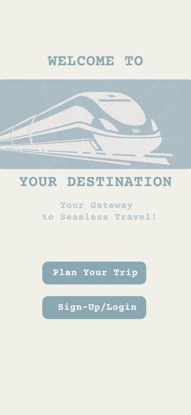
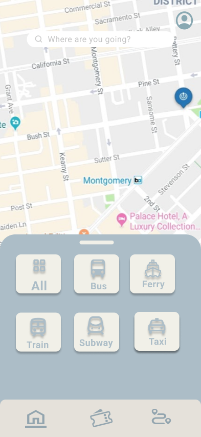
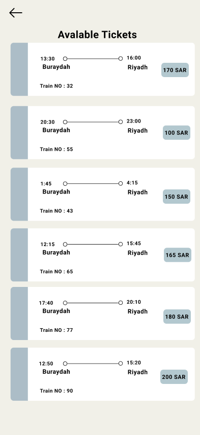
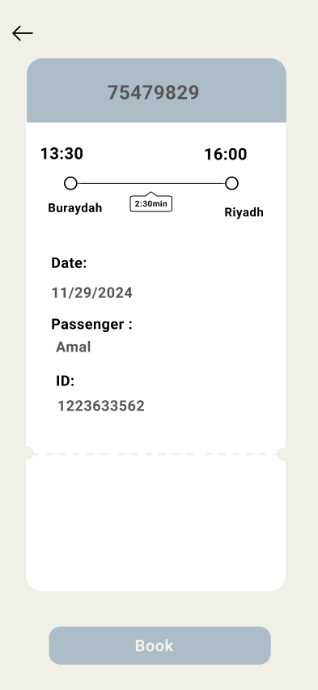
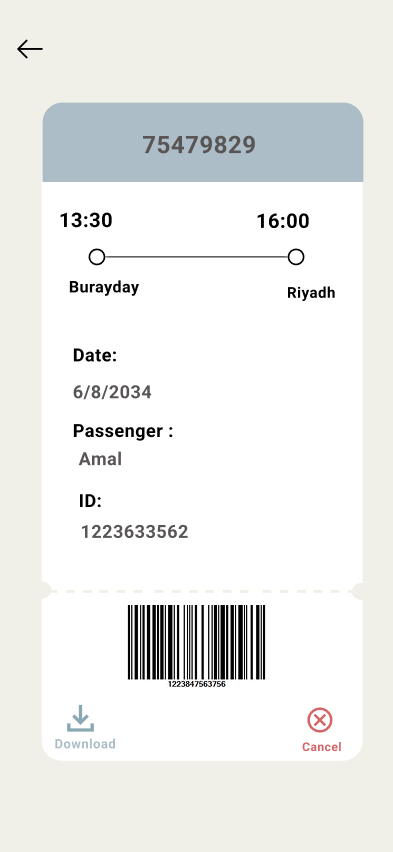
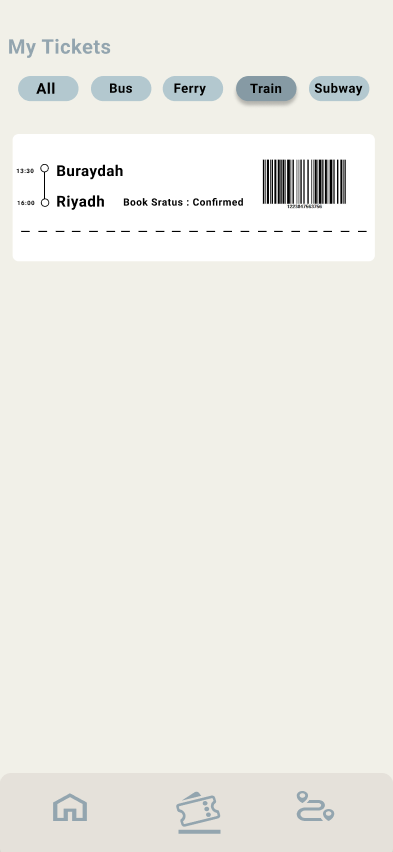
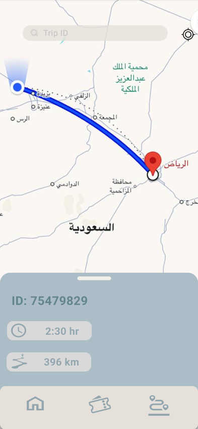

# Travel Ticket Booking UX/UI

## Overview

A mobile travel ticket booking application designed to make searching, booking, and managing travel tickets simple and convenient.

## Project Goals

* Provide a simple and intuitive booking experience
* Allow users to select their preferred transportation type
* Help users easily search for destinations and available tickets
* Display clear ticket information
* Provide a digital ticket with a barcode
* Allow users to view and manage their tickets

## Design Process

The project was designed with a user-centered approach:

1. Welcome & Authentication
2. Transportation Selection
3. Destination Selection
4. Ticket Search
5. Ticket Details
6. Digital Ticket & Barcode
7. My Tickets
8. Trip Tracking

## Screens

### Welcome

### Sign Up

### Login

### Select Transportation

### Select Destination

### Available Tickets

### Ticket Details

### Ticket Barcode

### My Tickets

### Trip Tracking

## Tools

* Figma

## Prototype

[View the interactive prototype in Figma](https://www.figma.com/proto/3kA4eb1wjAhXrp8RD6zZKu/Untitled?node-id=69-735&t=T3qLwuvfmMlquxzV-1)
